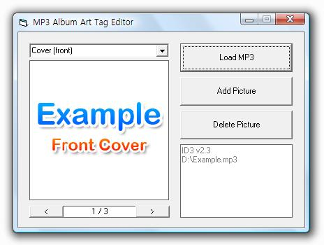



## MP3 Album Art Tag Editor

### Description

UPDATE(2 August 2010) - It supports multiple frames. UPDATE(21 May 2010) - ID3 v2.4 bug fixed.  This is MP3 Album Art tagging module. It reads, writes and deletes Album Art in ID3 v2.2, v2.3 and v2.4 tag. Sorry for my poor english. Please vote for me if you like it. :)
 
### More Info
 

             |
---                |---
**Submitted On**   |2010-07-31 17:33:50
**By**             |[OTIV](https://github.com/Planet-Source-Code/PSCIndex/blob/master/ByAuthor/otiv.md)
**Level**          |Intermediate
**User Rating**    |5.0 (40 globes from 8 users)
**Compatibility**  |VB 6\.0
**Category**       |[Sound/MP3](https://github.com/Planet-Source-Code/PSCIndex/blob/master/ByCategory/sound-mp3__1-45.md)
**World**          |[Visual Basic](https://github.com/Planet-Source-Code/PSCIndex/blob/master/ByWorld/visual-basic.md)
**Archive File**   |[MP3\_Album\_218559822010\.zip](https://github.com/Planet-Source-Code/otiv-mp3-album-art-tag-editor__1-73088/archive/master.zip)

